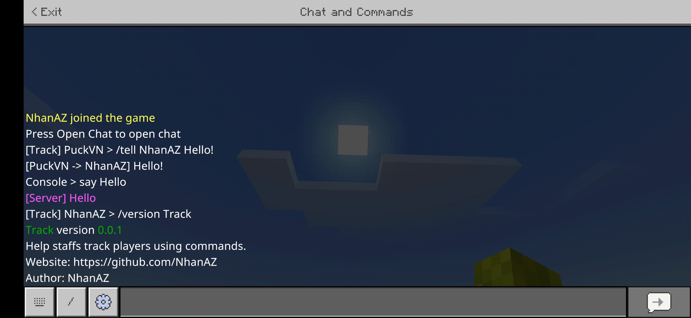

<h1>Track</img></h1> 

   

This is a PocketMine plugin that helps staffs track players using commands. 

<!-- 
 -->

<!-- 
 -->

# Features
- Allows selected staffs to watch players use commands to facilitate support.
- Selected people can review the commands they entered.
- Selected people are allowed to see console or rcon commands and players used.
- The console is allowed to see the commands the player uses.

# Setup
How to setup? Very simple! Follow the steps below:
- Step 1: Download the plugin and put it in plugins`(PocketMine-MP/plugins)`
- Step 2: Start the server to load `config.yml`
- Step 3: After server startup is complete, stop the server.
- Step 4: Go to the path `PocketMine-MP/plugin_data/Track/config.yml`
- Step 5: Then add the names of the employees who are allowed to view other players, consoles and rcon using the command at `config.yml`

# Future
- [X] Save the history of players using the command.
- [ ] Updated UI to make it easier to review someone's command usage history over a different period of time.
- [ ] And many other features recommended by plugin users, etc.

# Images

 <b>Tracking screen in-game</b> 

 <b>Tracking screen in console</b> 

# Configs
- [config.yml](https://github.com/NhanAZ/Track/blob/main/resources/config.yml)

- [history.yml](https://github.com/NhanAZ/Track/blob/main/resources/history.yml)

# Contact
If you encounter an error or would like to contribute to my plugin, contact me via the platforms below:
- Discord: NhanAZ#9115
- Xbox: NhanAZ
- Zalo: @thanhnhanaz
- FaceBook: fb.com/thanhnhanaz

# License
[GNU General Public License v3.0](https://www.gnu.org/licenses/gpl-3.0.html)
